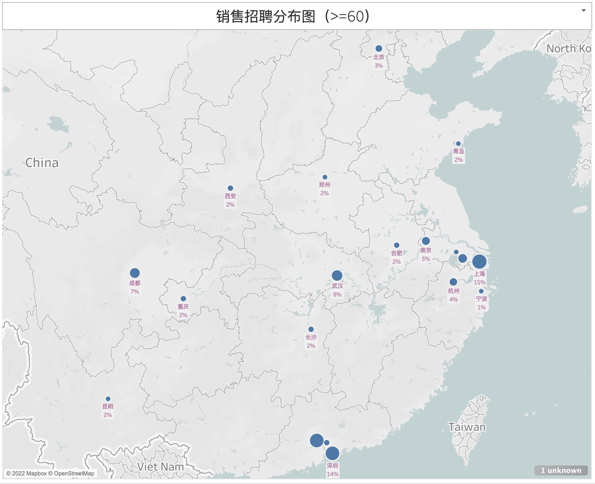
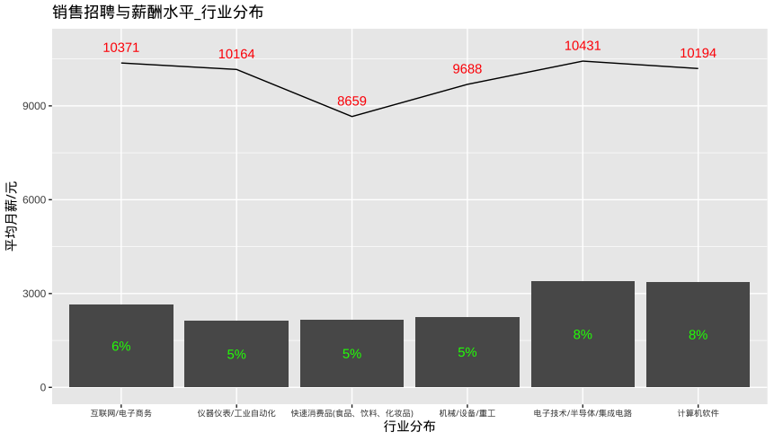
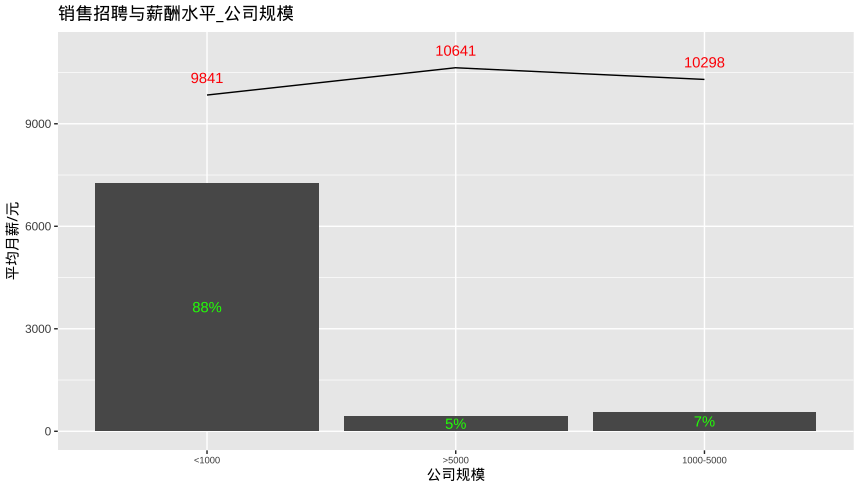
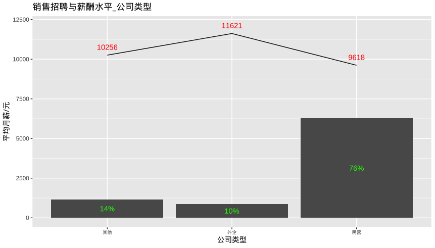
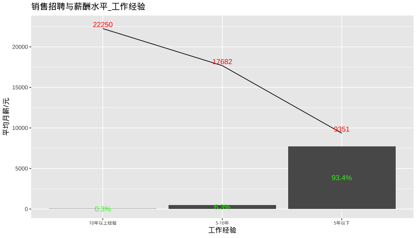
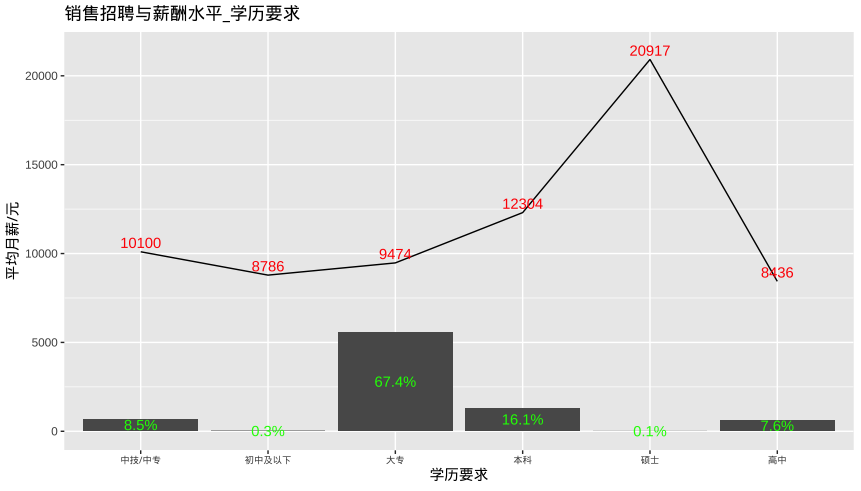
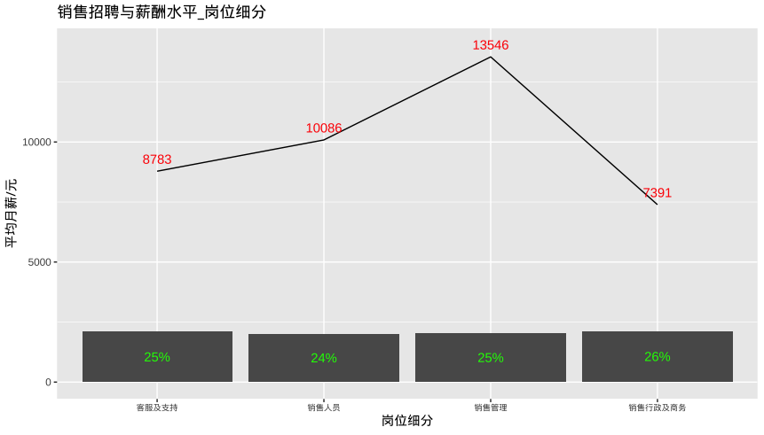

# 销售招聘和薪酬水平

## 总述

本次采集有效数据4144条，主要分析销售岗位招聘和薪酬水平，我们将从如下方面分析：

-   城市分布：
    -   上海占15%，平均月薪10787元；广州占15%，平均月薪10652元；深圳占14%，平均月薪10963元，其余城市均在8%或以下。
-   行业分布：
    -   电子技术/半导体/集成电路占8%，平均月薪10431元；计算机软件占8%，平均月薪10194元；互联网/电商占6%，平均月薪10371元；其余行业均在5%或以下。
-   公司规模：
    -   1000人以下占88%，平均月薪9841元；1000-5000人占7%，平均月薪10298元；5000人以上占5%，平均月薪10641元。
-   公司类型：
    -   民营占76%，平均月薪9618元；外企占10%，平均月薪11621元。
-   工作经验：
    -   5年以下占93%，平均月薪9351元；5-10年占6%，平均月薪17682元。
-   学历要求：
    -   大专占67%，平均月薪9474元；本科占16%，平均月薪12304元；中专占9%，平均月薪10100元。
-   细分岗位：
    -   销售行政及商务，平均月薪7391元；客服及支持，平均月薪8783元；销售管理，平均月薪13546元；销售人员，平均月薪10086元。

## 城市分布

## 行业分布

## 公司规模

## 公司类型

## 工作经验

## 学历要求

## 岗位细分

